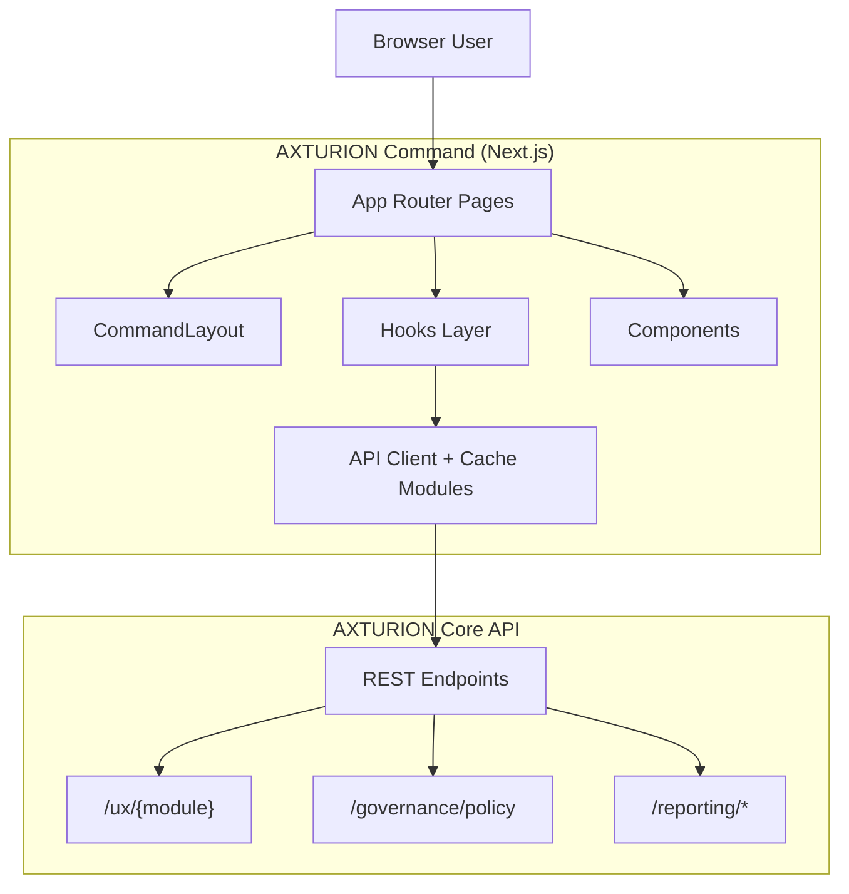

# AXTURION Command Architecture (Next.js)

AXTURION Command is the frontend control plane for recruiters/admins.

Command is responsible for:
- Presenting dashboards and analytics
- Rendering policy-driven UI behavior (SLA colors, layouts, themes)
- Providing admin tools (UXConfig versioning + rollback)
- Calling AXTURION Core APIs using org/user identity headers

Command does **not**:
- enforce business rules
- decide authorization
- own governance logic
- store authoritative state

All enforcement happens in Core.

---

## Frontend System Map

---

## Folder Responsibilities (Recommended)

Typical structure (your repo may vary slightly):

- `app/`  
  Next.js pages (routes). Each page orchestrates hooks + components.

- `src/components/`  
  Presentation components: tables, cards, layout wrappers.

- `src/hooks/`  
  UI data hooks: fetch + state management (loading/error/refetch).

- `src/lib/`  
  Low-level API clients, caching utilities, schema validation helpers.

---

## Identity & Auth Context

Command reads identity from browser localStorage:

- `org_id`
- `user_id`

Each API request includes headers:

- `X-Org-Id: <org_id>`
- `X-User-Id: <user_id>`

Authorization is determined by Core membership + role scopes.
Frontend never assumes permission.

---

## UXConfig System

### Purpose
UXConfig allows controlled per-module UI customization:

- layout: `"default" | "compact" | "dense"`
- theme: `"dark" | "light" | "defense"`
- flags: `Record<string, boolean>`

### Fetching UXConfig
- Raw network call: `src/lib/api.ts`
- Cache + dedupe: `src/lib/uxConfigCache.ts`
- Hook: `src/hooks/useUXConfig.ts`
- Applied in: `src/components/layout/CommandLayout.tsx`

### Caching Rules
- Cache key: `(org_id, user_id, module)`
- TTL: 5 minutes
- Dedupes concurrent calls (shared Promise)
- Force refresh is supported
- Invalidations are broadcast via `uxconfig:invalidate`

---

## Governance-Driven UI (PolicyConfig)

PolicyConfig influences UI interpretation, not backend state.

Example:
- `stage_aging_sla_days` determines Stage Aging SLA highlight threshold.

Fetch pattern:
- API helper in `src/lib/governanceApi.ts`
- Hook in `src/hooks/usePolicyConfig.ts`
- Used in dashboard page to compute SLA breach metrics

Fallback behavior:
- If policy fetch fails → fallback defaults (e.g., 7 days)

---

## Dashboard Architecture

Dashboard is composed of:
- `TimeToCloseCard`
- `StageAgingTable`
- `StageDurationTable`
- `SLABreachCard` (count + percentage)

Data sources:
- `/reporting/time-to-close`
- `/reporting/stage-aging`
- `/reporting/stage-duration-summary`
- `/governance/policy` (SLA threshold)

Dashboard principles:
- UI-only aggregation (no backend mutation)
- Safe loading + error states
- No flicker where cache exists

---

## UX Admin (Versions + Rollback)

Admin page:
- `/admin/ux/[module]`

Features:
- lists version history
- highlights active version
- shows diffs between versions
- rollback (may require 4-eyes approval, enforced by Core)

UX Admin never bypasses backend governance.

---

## Design Principles

1. All authority is in Core.
2. Command renders policy-driven UI.
3. Cache is safe, bounded, and invalidatable.
4. Hooks are deterministic, typed, and refetchable.
5. UI is resilient to missing data and permission errors.
6. Admin tooling is auditable (via Core audit chain).

---

AXTURION Command is the controlled interface to a governed backend.
It is intentionally "thin" and policy-driven.
