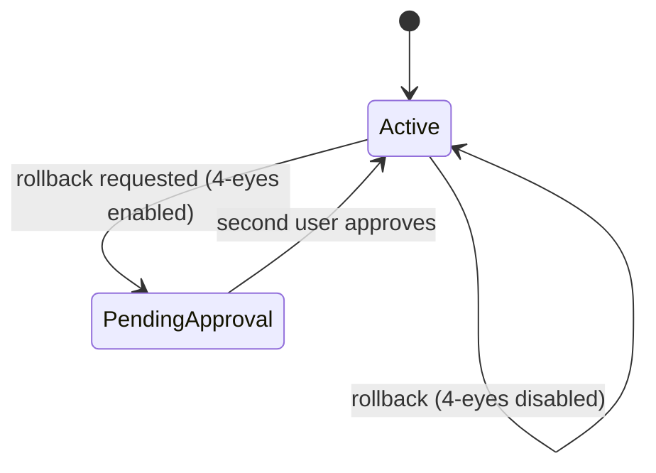

# AXTURION UX Config System

The UX Config System enables controlled, auditable UI customization per organization and module.

It allows:

- Layout customization
- Theme selection
- Feature flags
- Version history
- Diff inspection
- Rollback
- Optional 4-eyes approval enforcement

All logic is enforced in AXTURION Core.

---

# System Overview

```mermaid
graph TD

    Admin[Admin User]

    subgraph Command["AXTURION Command"]
        UXAdminPage[UX Admin Page]
        VersionTable[Version History]
        RollbackButton[Rollback Action]
    end

    subgraph Core["AXTURION Core"]
        UXEndpoint[/ux/{module}]
        VersionsEndpoint[/ux/{module}/versions]
        RollbackEndpoint[/ux/{module}/rollback]
        PendingModel[PendingUXRollback]
        PolicyConfig[PolicyConfig]
        AuditLog[AuditLog]
    end

    Admin --> UXAdminPage
    UXAdminPage --> UXEndpoint
    UXAdminPage --> VersionsEndpoint
    VersionTable --> RollbackButton
    RollbackButton --> RollbackEndpoint

    RollbackEndpoint --> PolicyConfig
    RollbackEndpoint --> PendingModel
    RollbackEndpoint --> AuditLog
    UXEndpoint --> AuditLog
```

---

# UXConfig Data Model

Stored per:

- organization_id
- module

Structure:

```json
{
  "layout": "default" | "compact" | "dense",
  "theme": "dark" | "light" | "defense",
  "flags": {
    "feature_x": true,
    "feature_y": false
  }
}
```

Strict write schema:
- layout: Literal
- theme: Literal
- flags: Record<string, boolean>
- extra keys forbidden on write

Loose read schema:
- extra keys allowed (future-proof)

---

# Core Endpoints

## 1. Get Current Config

```
GET /ux/{module}
Scope: UX_READ
```

Returns:

```json
{
  "module": "dashboard",
  "config": { ... }
}
```

If no config exists:
- returns empty config
- does not error

---

## 2. Update Config

```
PUT /ux/{module}
Scope: UX_WRITE
```

Behavior:

- Strict validation
- Overwrites entire config snapshot
- Appends audit log:

```
action = "ux_config_updated"
entity_type = "ux_config"
entity_id = "{org_id}:{module}"
```

Atomic transaction with audit entry.

---

## 3. Version History

```
GET /ux/{module}/versions
Scope: UX_READ
```

Returns:

- ordered list (ASC by sequence)
- version number (1..N)
- updated_at
- actor_id
- sanitized config snapshot
- is_active (true/false)
- diff vs previous version

Diff includes:

- layout changes
- theme changes
- flags added
- flags removed
- flags changed

Version 1:
- diff = null

---

## 4. Rollback

```
POST /ux/{module}/rollback
Scope: UX_WRITE
Body: { "version": number }
```

Rollback behavior depends on PolicyConfig:

### Case A — 4-Eyes Disabled

Immediate:

1. Replace config with snapshot
2. Append audit:
   - ux_config_rollback
3. Return 200

---

### Case B — 4-Eyes Enabled

First request:

1. Create PendingUXRollback
2. Append audit:
   - ux_rollback_pending
3. Return 202:
   ```json
   { "approval_required": true }
   ```

Second user request:

1. Validate different user
2. Delete pending record
3. Append audit:
   - ux_rollback_approved
4. Apply rollback
5. Append audit:
   - ux_config_rollback
6. Return 200

Same user attempting second approval:
- 403 Forbidden

---

# Rollback State Machine



---

# Caching (Frontend)

Frontend caching layer:

- Cache key: (org_id, user_id, module)
- TTL: 5 minutes
- Deduplicated in-flight requests
- Invalidation via broadcast event: `uxconfig:invalidate`
- Refetch after rollback

Cache does not bypass governance.
Backend remains source of truth.

---

# Audit Integration

UX actions generate audit entries:

| Action | When |
|--------|------|
| ux_config_updated | config changed |
| ux_rollback_pending | first rollback request |
| ux_rollback_approved | second approval |
| ux_config_rollback | rollback applied |

All entries are:

- Org-scoped
- Hash chained
- Sequence validated

---

# Security Model

- All writes require UX_WRITE
- All reads require UX_READ
- Role-scope mapping enforced in Core
- Frontend never bypasses scope checks
- Pending rollbacks prevent unilateral config manipulation

---

# Design Principles

1. UX flexibility must remain auditable.
2. No silent UI manipulation.
3. Rollbacks must be traceable.
4. 4-eyes is policy-driven, not hardcoded.
5. Backend enforces; frontend presents.
6. Versioning uses AuditLog as source of truth.

---

# Why This Matters

UX configuration in enterprise systems is a risk vector.

AXTURION solves this by:

- Snapshot-based versioning
- Full diff visibility
- Approval workflows
- Audit chaining
- Org isolation

This is controlled customization — not uncontrolled theming.