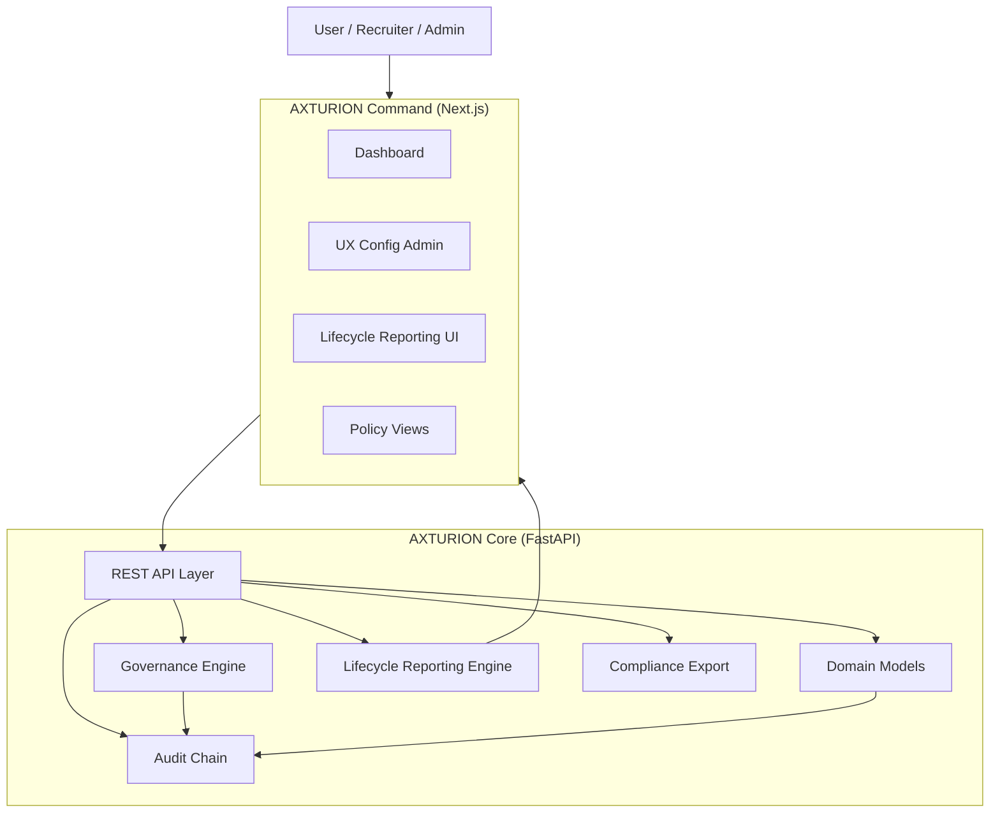

# AXTURION Platform Architecture

This document provides a high-level overview of the AXTURION platform.

The platform consists of two primary runtime systems:

- **AXTURION Core** (FastAPI backend)
- **AXTURION Command** (Next.js frontend)

Governance, audit integrity, reporting, and compliance are first-class architectural concerns.

---

## System Overview

---

## Architectural Layers

### 1. Command (Presentation Layer)

Responsible for:
- Dashboard metrics
- SLA breach visualization
- UX configuration admin
- Version history + rollback UI
- Local caching (UXConfig)

Command does **not**:
- Own business rules
- Own SLA logic
- Own governance enforcement

All business rules live in Core.

---

### 2. Core (Application + Domain Layer)

Core is responsible for:

- Domain entities (Applications, Jobs, Candidates, Workflows)
- Lifecycle state transitions
- Audit log append-only integrity chain
- Governance rules (PolicyConfig)
- SLA policy enforcement (org-scoped)
- 4-eyes rollback approvals
- Retention preview
- Reporting calculations
- Compliance bundle generation

Core is stateless beyond database persistence.

---

### 3. Governance Engine

Governance is not a feature — it is a system layer.

Includes:
- PolicyConfig (org-scoped)
- SLA configuration
- Retention rules
- 4-eyes UX rollback
- Scope-based authorization (RBAC)
- Audit logging of policy changes

Governance decisions are auditable.

---

### 4. Reporting Layer

Lifecycle reporting includes:

- Stage Aging
- Time to Close
- Stage Duration Summary

Reporting:
- Is org-scoped
- Is derived from domain state + audit events
- Does not mutate state
- Feeds the Dashboard

---

### 5. Audit Chain

The audit system:

- Is append-only
- Uses hash chaining
- Supports verification
- Captures governance changes
- Captures UX configuration updates
- Captures rollback approvals

Audit integrity is a core enterprise feature.

---

## Data Flow Summary

User → Command → Core API → Domain  
                        ↓  
                    Governance  
                        ↓  
                     Audit  
                        ↓  
                   Reporting  
                        ↓  
                    Dashboard

---

## Platform Principles

1. Governance-first architecture
2. Org-scoped isolation
3. Audit integrity by default
4. Reporting derived from state
5. Frontend as presentation layer only
6. No silent rule changes
7. All critical changes auditable

---

AXTURION is not just an ATS — it is a governed recruitment execution platform.