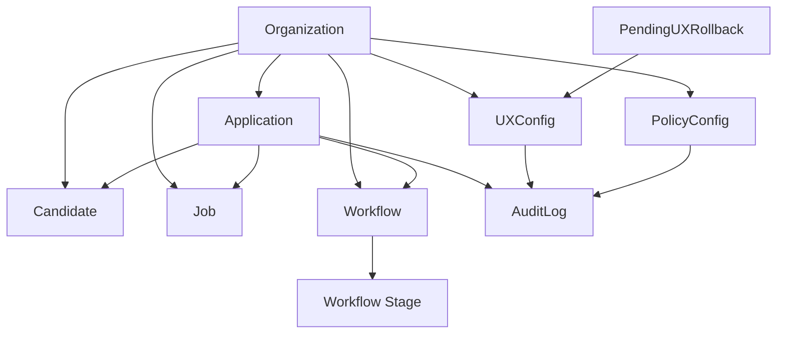

# AXTURION Core Architecture

This document describes the internal domain structure of AXTURION Core.

Core is responsible for:

- Domain entities
- Lifecycle state management
- Governance enforcement
- Reporting calculations
- Audit logging
- Compliance export

Core follows a layered architecture:

API → Services → Domain Models → Database  
All critical mutations → Audit Chain

---

## Domain Model Overview

---

## Core Domain Entities

### 1. Organization

Top-level isolation boundary.

All entities are org-scoped.

Multi-tenancy enforced at database query level.

---

### 2. Application

Represents a candidate applying for a job.

Attributes:
- status (open / closed / hired / rejected)
- workflow_id
- current_stage
- timestamps (created_at, closed_at)

Application mutations:
- stage transitions
- close events

All mutations are audited.

---

### 3. Workflow

Defines lifecycle process.

Contains:
- ordered stages
- stage transitions

Workflow does not store analytics.
Reporting derives from audit + timestamps.

---

### 4. Candidate

Represents a person.

Org-scoped.
Referenced by Applications.

---

### 5. Job

Represents a job opening.

Org-scoped.
Referenced by Applications.

---

## Governance Domain Objects

### PolicyConfig

Org-level governance rules:

- stage_aging_sla_days
- retention rules
- 4-eyes requirements

Affects runtime behavior.
Audited on update.

---

### UXConfig

Stores module-specific UI configuration.

Supports:
- version history
- diff inspection
- rollback
- 4-eyes enforcement

All changes audited.

---

### PendingUXRollback

Temporary approval entity.

Exists only when 4-eyes policy enabled.

Prevents unilateral rollback.

---

## Audit Model

AuditLog:

- Append-only
- Hash chained
- Sequence validated
- Org-scoped
- Used for:
    - verification
    - compliance export
    - governance traceability

Audit captures:

- Application changes
- Policy updates
- UX config updates
- Rollbacks
- Governance events

---

## Reporting Layer (Derived Data)

Reporting does not own state.

It derives from:

- Application timestamps
- Audit events
- Workflow stage transitions

Endpoints include:

- Stage Aging
- Time to Close
- Stage Duration Summary

Reporting is read-only.

---

## Service Layer Responsibilities

Services:

- Enforce org scoping
- Validate transitions
- Apply governance rules
- Append audit entries
- Keep business logic out of API layer

API layer only:
- Validates request schema
- Calls service
- Returns response model

---

## Core Design Principles

1. Org isolation is absolute.
2. Audit is append-only.
3. Reporting is derived, never authoritative.
4. Governance rules affect interpretation, not state mutation.
5. Business logic lives in services, not routes.
6. Frontend never enforces domain rules.

---

AXTURION Core is a governed lifecycle execution engine.
It is not just CRUD — it is policy-aware state management.